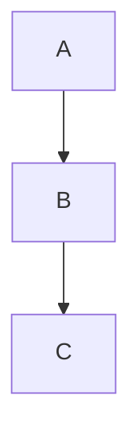

# Block Directives

This file exercises all `:::name` / `:::/name` directive cases.

## Basic directive — bare close

:::note
This is a simple note with a single paragraph.
:::

## Basic directive — named close

:::tip
A tip block closed with an explicit name.
:::/tip

## Directive with attributes

:::callout type=warning class=bordered
Content inside a callout with two attributes.
:::

## Directive with quoted attribute value

:::callout title="Hello: World" level=2
Quoted attribute containing a colon.
:::

## Directive containing multiple block types

:::card
# Card Heading

A paragraph inside the card.

- list item one
- list item two

| Col A | Col B |
| ----- | ----- |
| x     | y     |

```python
print("code inside directive")
```
:::

## Nested directives

:::columns
:::col
Left column content.

More left content.
:::

:::col
Right column content with **bold** and *italic*.
:::
:::

## Deeply nested directives

:::outer
:::middle
:::inner
Innermost paragraph.
:::
:::
:::

## Directive adjacent to normal content

Paragraph before directive.

:::aside
Content inside aside.
:::

Paragraph after directive.

## Multiple sibling directives

:::step
Step one content.
:::

:::step
Step two content with a [link](https://example.com).
:::

:::step
Step three content with :[badge]{chip label=NEW}.
:::

## Directive with heading-level content preserved

:::section id=intro
## Introduction

This is the intro section body.
:::

## Fenced block INSIDE directive (fenced is leaf, not a directive)

:::demo
Here is a code block inside the directive:

```javascript
const x = 42;
console.log(x);
```

And a mermaid diagram:


:::

## Fenced block that LOOKS like a directive (must be raw text)

```text
:::fake
This must NOT become a directive node.
:::/fake
```

## Indented fenced block guarding (3-space indent)

   ```
   :::also-fake
   Still raw text.
   ```

## Directive with inline widgets in body

:::highlight
The signal :[LO]{tooltip text="Local Oscillator"} drives the mixer.
:::

## Directive with math in body

:::theorem name="Pythagoras"
In a right triangle: $a^2 + b^2 = c^2$.

$$
c = \sqrt{a^2 + b^2}
$$
:::

## Directive immediately at end of file (no trailing newline)
:::footer
Footer content.
:::
